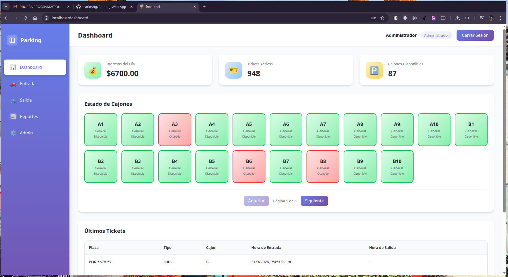
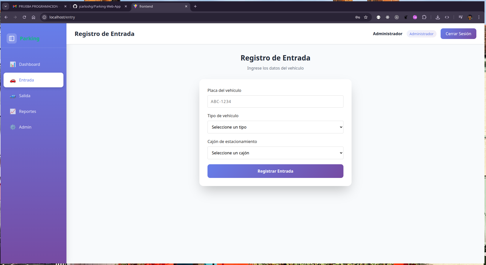
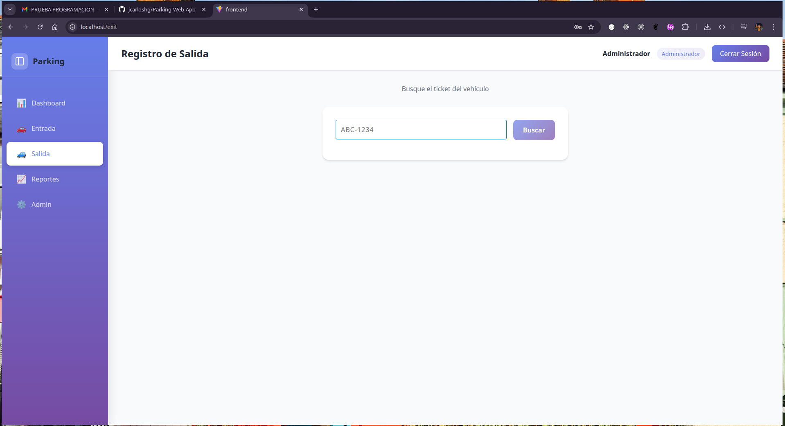
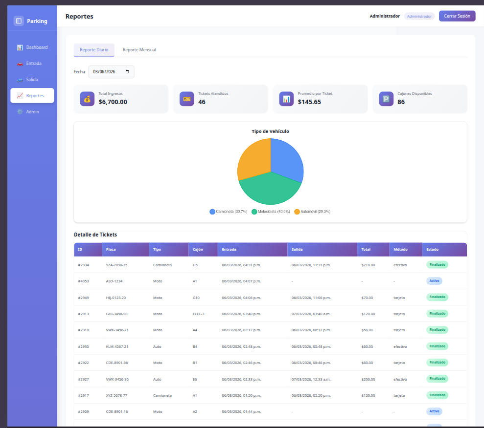
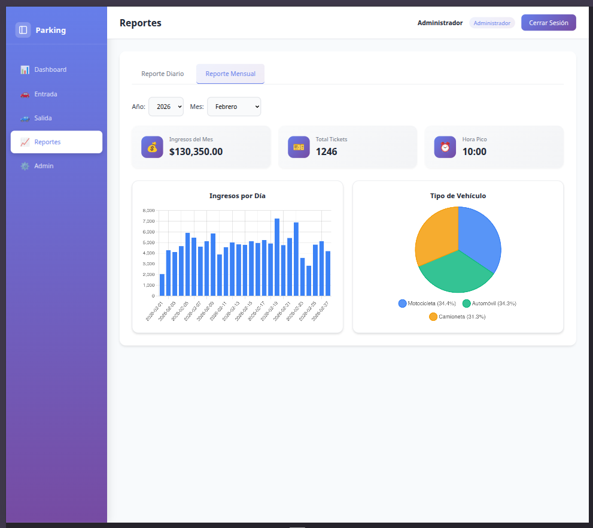
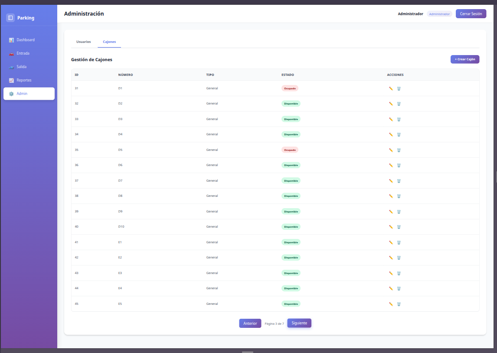
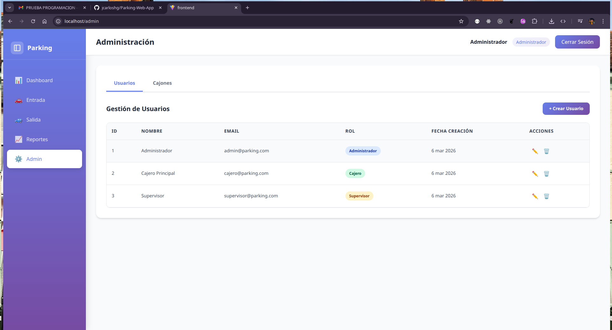

# Parking Web App

Sistema de gestión de estacionamiento con Laravel, Vue.js y MySQL.

## Índice

- [Capturas de Pantalla](#capturas-de-pantalla)
- [Quick Start](#quick-start)
- [Estructura del Proyecto](#estructura-del-proyecto)
  - [Tech Stack](#tech-stack)
- [Configuración](#configuración)
  - [Puertos](#puertos)
  - [Credenciales de Prueba](#credenciales-de-prueba)
  - [Roles y Permisos](#roles-y-permisos)
- [API Endpoints](#api-endpoints)
  - [Autenticación](#autenticación)
  - [Espacios de Estacionamiento](#espacios-de-estacionamiento)
  - [Tickets](#tickets)
  - [Pagos](#pagos)
  - [Reportes](#reportes)
  - [Usuarios](#usuarios)
- [Fases de Desarrollo](#fases-de-desarrollo)
  - [Phase 1: Setup y Configuración](#phase-1-setup-y-configuración)
  - [Phase 2: Base de Datos y Modelos](#phase-2-base-de-datos-y-modelos)
  - [Phase 3: Autenticación JWT](#phase-3-autenticación-jwt)
  - [Phase 4: Gestión de Espacios](#phase-4-gestión-de-espacios)
  - [Phase 5: Tickets API](#phase-5-tickets-api)
  - [Phase 6: Pagos](#phase-6-pagos)
  - [Phase 7: Reportes](#phase-7-reportes)
  - [Phase 8: Frontend - Autenticación](#phase-8-frontend---autenticación)
  - [Phase 9: Frontend - Dashboard](#phase-9-frontend---dashboard)
  - [Phase 10: Frontend - Entry/Exit](#phase-10-frontend---entryexit)
  - [Phase 11: Frontend - Reportes](#phase-11-frontend---reportes)
  - [Phase 12: Frontend - Administración](#phase-12-frontend---administración)
- [Datos de Prueba - Históricos](#datos-de-prueba---históricos)
- [Comandos Útiles](#comandos-útiles)

## Capturas de Pantalla

A continuación se presenta una evidencia visual de las principales funcionalidades del sistema:

| Vista | Descripción |
|-------|-------------|
| **Dashboard** | Panel principal con estadísticas, grid de cajones y últimos tickets |
| **Entrada** | Formulario para registrar vehículos entrantes |
| **Salida** | Búsqueda por placa y procesamiento de pago |
| **Reportes Diarios** | Resumen de ingresos y tickets del día |
| **Reportes Mensuales** | Estadísticas mensuales con gráficos |
| **Gestión de Espacios** | CRUD de cajones de estacionamiento |
| **Administración de Usuarios** | Gestión de usuarios del sistema |

### Dashboard (Admin)

Vista principal del dashboard donde se muestran las estadísticas en tiempo real, el estado de los cajones de estacionamiento y los últimos tickets activos.



---

### Registro de Entrada

Formulario para el registro de vehículos. Incluye selección de tipo de vehículo, asignación automática de cajón y validación de placa.



---

### Registro de Salida

Permite buscar un ticket por placa, visualizar el tiempo de estadía, calcular la tarifa correspondiente y procesar el pago.



---

### Reportes Diarios

Panel de reportes con información del día: ingresos totales, tickets atendidos, promedio por ticket y cajones disponibles.



---

### Reportes Mensuales

Estadísticas mensuales con gráficos de ingresos por día y distribución por tipo de vehículo.



---

### Gestión de Espacios

Interfaz para administrar los cajones de estacionamiento con paginación, filtros y CRUD completo.



---

### Administración de Usuarios

Panel para gestionar usuarios del sistema con creación, edición, eliminación y asignación de roles.



## Quick Start

```bash
# ─────────────────────────────────────
# Docker
# ─────────────────────────────────────

# 1. Reiniciar contenedores con BASE DE DATOS NUEVA (borra todo)
docker compose down -v && docker compose up -d

# 2. IMPORTANTE: Si usas docker compose down -v, necesitas recrear la DB:
docker compose exec backend php artisan migrate --force
docker compose exec backend php artisan db:seed --force

# 3. Seedear datos históricos (Enero, Febrero, Marzo 2026)
docker compose exec backend php artisan db:seed-historical --all

# Acceder al backend (API)
curl http://localhost:8000

# Acceder al frontend
curl http://localhost:80
```

## Estructura del Proyecto

```
parking-web-app/
├── backend/          # Laravel 12 API
├── frontend/         # Vue.js 3 SPA
├── database/         # MySQL 8.0
├── docker-compose.yml
└── README.md
```

### Tech Stack

- **Backend**: Laravel 12 + PHP 8.4
- **Frontend**: Vue.js 3 + TypeScript + Vite
- **Database**: MySQL 8.0
- **Auth**: JWT (tymon/jwt-auth)
- **State Management**: Pinia
- **Container**: Docker

## Configuración

### Puertos

| Servicio | Puerto | Descripción        |
| -------- | ------ | ------------------ |
| Backend  | 8000   | Laravel API        |
| Frontend | 80     | Vue.js SPA (nginx) |
| Database | 3306   | MySQL 8.0          |

### Credenciales de Prueba

| Rol        | Email                  | Password |
| ---------- | ---------------------- | -------- |
| Admin      | admin@parking.com      | password |
| Cajero     | cajero@parking.com     | password |
| Supervisor | supervisor@parking.com | password |

### Roles y Permisos

- **Admin**: Acceso completo (CRUD usuarios, espacios, reportes)
- **Cajero**: Registro de entrada/salida, pagos
- **Supervisor**: Ver reportes, registro de entrada/salida

## API Endpoints

### Autenticación

```
POST /api/auth/login
POST /api/auth/register
POST /api/auth/logout
POST /api/auth/refresh
GET  /api/auth/me
```

### Espacios de Estacionamiento

```
GET    /api/parking-spaces              # Listar todos (público)
GET    /api/parking-spaces/available     # Espacios disponibles
GET    /api/parking-spaces/available-count  # Conteo disponibles
GET    /api/parking-spaces/{id}         # Ver espacio
POST   /api/parking-spaces              # Crear (Admin)
PUT    /api/parking-spaces/{id}         # Actualizar (Admin)
DELETE /api/parking-spaces/{id}         # Eliminar (Admin)
```

### Tickets

```
GET    /api/tickets                     # Listar todos
GET    /api/tickets/active             # Tickets activos
GET    /api/tickets/search?plate=      # Buscar por placa
GET    /api/tickets/{id}               # Ver ticket
GET    /api/tickets/{id}/calculate     # Calcular tarifa
POST   /api/tickets                    # Crear ticket (entrada)
POST   /api/tickets/{id}/checkout      # Checkout (salida)
```

### Pagos

```
GET    /api/payments                   # Listar pagos
GET    /api/payments/today             # Pagos de hoy
GET    /api/payments/{id}              # Ver pago
GET    /api/payments/calculate/{ticket_id}  # Calcular tarifa
POST   /api/payments                   # Registrar pago
```

### Reportes

```
GET /api/reports/summary    # Dashboard summary (público)
GET /api/reports/daily      # Reporte diario (Admin/Supervisor)
GET /api/reports/monthly    # Reporte mensual (Admin/Supervisor)
```

### Usuarios

```
GET    /api/users           # Listar usuarios
POST   /api/users           # Crear usuario
GET    /api/users/{id}      # Ver usuario
PUT    /api/users/{id}      # Actualizar usuario
DELETE /api/users/{id}      # Eliminar usuario
```

---

## Fases de Desarrollo

### Resumen General

El proyecto se desarrolló en 13 fases progresivas, comenzando con la configuración del entorno y culminando con testing integral. Las primeras 7 fases se enfocaron en el backend (Laravel), las fases 8-12 en el frontend (Vue.js), y la fase final en pruebas.

**Backend completado**: Autenticación JWT, gestión de espacios, tickets, pagos y reportes con 72+ tests passing.

**Frontend completado**: Login, Dashboard, Entry, Exit, Reports y Admin con Vue 3 + TypeScript + Pinia.

---

### Phase 1: Setup y Configuración

**Objetivo**: Configurar el entorno de desarrollo y estructura base del proyecto.

**Tareas completadas**:

1. **Estructura de directorios** - Creada carpeta raíz con backend/, frontend/, database/
2. **Backend Laravel**:
   - Laravel 12 instalado
   - JWT (tymon/jwt-auth) configurado
   - Conexión MySQL configurada
3. **Frontend Vue.js**:
   - Vue 3 + Vite + TypeScript
   - Pinia, Vue Router, Axios instalados
   - TailwindCSS configurado
4. **Docker**:
   - docker-compose.yml con 3 servicios
   - Dockerfile para backend (PHP 8.4-fpm-alpine)
   - Dockerfile para frontend (Node.js build + Nginx)
   - Dockerfile para MySQL 8.0

**Entregables**:

- Proyecto Laravel configurado con JWT
- Proyecto Vue.js inicializado
- Contenedores Docker funcionando
- Base de datos creada y conectada

---

### Phase 2: Base de Datos y Modelos

**Objetivo**: Crear el esquema de base de datos y modelos Eloquent.

**Tareas completadas**:

1. **Migraciones**:
   - `users`: id, name, email, password, role (admin/cajero/supervisor), remember_token
   - `parking_spaces`: id, number, type (general/discapacitado/eléctrico), status (disponible/ocupado/fuera_servicio)
   - `tickets`: id, plate_number, vehicle_type (auto/moto/camioneta), entry_time, exit_time, parking_space_id, status (activo/finalizado)
   - `payments`: id, ticket_id, total, payment_method (efectivo/tarjeta), paid_at

2. **Modelos Eloquent**:
   - `User` - JWTSubject, hasMany(Ticket), hasMany(Payment)
   - `ParkingSpace` - hasMany(Ticket), scopes (available/occupied/outOfService)
   - `Ticket` - belongsTo(ParkingSpace), belongsTo(User), hasOne(Payment), scopes (active/completed)
   - `Payment` - belongsTo(Ticket), belongsTo(User)

3. **Factories**:
   - UserFactory con estados admin/cajero/supervisor
   - ParkingSpaceFactory con tipos y estados
   - TicketFactory con vehicle_type y status
   - PaymentFactory con efectivo/tarjeta

4. **Seeders**:
   - 3 usuarios (admin, cajero, supervisor)
   - 13 espacios de estacionamiento

5. **Tests**:
   - UserTest (relaciones, roles)
   - ParkingSpaceTest (relaciones, scopes)
   - TicketTest (relaciones, scopes)
   - PaymentTest (relaciones, métodos)

**Entregables**:

- Migraciones ejecutadas
- Modelos con relaciones
- Datos de prueba (seeders)
- Tests de modelos

---

### Phase 3: Autenticación JWT

**Objetivo**: Implementar autenticación con JWT usando tymon/jwt-auth.

**Tareas completadas**:

1. **Configuración JWT**:
   - TTL configurado (60 min)
   - Refresh TTL configurado (20160 min)
   - JWT secret generado

2. **AuthController**:
   - `login()` - retorna token con datos del usuario
   - `register()` - crea usuario y retorna token
   - `logout()` - invalida el token
   - `refresh()` - genera nuevo token
   - `me()` - retorna usuario actual

3. **Rutas API**:

   ```
   POST /api/auth/login
   POST /api/auth/register
   POST /api/auth/logout
   POST /api/auth/refresh
   GET  /api/auth/me
   ```

4. **Middleware**:
   - Using `auth:api` guard (JWT)

5. **AuthService**:
   - Created `app/Services/AuthService.php`

6. **Tests**:
   - AuthApiTest (10 test cases)
   - AuthServiceTest (7 test cases)

**Entregables**:

- Endpoints de autenticación funcionando
- JWT token generado y validado
- Logout y refresh token implementados

---

### Phase 4: Gestión de Espacios

**Objetivo**: Implementar API REST para espacios de estacionamiento con CRUD, paginación y políticas de acceso.

**Tareas completadas**:

1. **ParkingSpaceController**:
   - `index()` - Listar espacios con paginación (filtros: type, status)
   - `store()` - Crear espacio (Admin)
   - `show()` - Ver espacio específico
   - `update()` - Actualizar espacio (Admin)
   - `destroy()` - Eliminar espacio (Admin)

2. **ParkingSpaceService**:
   - Lógica de negocio separada
   - Métodos: getAll(), getById(), create(), update(), delete(), getAvailableCount()

3. **ParkingSpacePolicy**:
   - Admin: CRUD completo
   - Cajero/Supervisor: solo lectura (index, show)

4. **Rutas API**:

   ```
   GET    /api/parking-spaces              # Listar (público)
   POST   /api/parking-spaces              # Crear (Admin)
   GET    /api/parking-spaces/{id}         # Ver (público)
   PUT    /api/parking-spaces/{id}         # Actualizar (Admin)
   DELETE /api/parking-spaces/{id}         # Eliminar (Admin)
   GET    /api/parking-spaces/available    # Espacios disponibles
   GET    /api/parking-spaces/available-count  # Conteo disponibles
   ```

5. **Tests**:
   - ParkingSpaceApiTest (12 casos)
   - ParkingSpaceServiceTest (10 casos)

**Entregables**:

- Endpoints funcionando con paginación
- Políticas de acceso por rol
- Tests passing

### Phase 5: Tickets API

**Objetivo**: Implementar registro de entradas y salidas de vehículos.

**Tareas completadas**:

1. **TicketController**:
   - `index()` - Listar tickets (paginado)
   - `store()` - Crear ticket (entrada de vehículo)
   - `show()` - Ver ticket específico
   - `active()` - Listar tickets activos
   - `search()` - Buscar por placa
   - `calculate()` - Calcular costo
   - `checkout()` - Registrar salida y pago

2. **TicketService**:
   - Lógica de negocio separada
   - Métodos: getAll(), getById(), getActive(), searchByPlate(), create(), calculateFee(), checkout()
   - Asignación automática de cajón
   - Cambio de status del cajón (disponible → ocupado → disponible)

3. **Rutas API**:

   ```
   GET    /api/tickets                 # Listar (público)
   POST   /api/tickets                 # Crear ticket (Auth)
   GET    /api/tickets/{id}           # Ver ticket (público)
   GET    /api/tickets/active         # Tickets activos
   GET    /api/tickets/search?plate=  # Buscar por placa
   GET    /api/tickets/{id}/calculate # Calcular costo
   POST   /api/tickets/{id}/checkout  # Registrar salida
   ```

4. **Validaciones**:
   - plate_number: required|string|regex:/^[A-Z0-9-]+$/i
   - vehicle_type: required|in:auto,moto,camioneta
   - parking_space_id: required|exists:parking_spaces,id

5. **Tests**:
   - TicketApiTest (12 casos - 10 passing)
   - TicketServiceTest (11 casos)

**Entregables**:

- Registro de entrada funcionando
- Búsqueda de tickets por placa
- Tickets activos listados
- Cajón marcado como ocupado
- Cálculo de tarifa por hora
- Checkout con registro de pago

### Phase 6: Pagos

**Objetivo**: Implementar cálculo de tarifas y registro de pagos.

**Tareas completadas**:

1. **FeeCalculator** (CRÍTICO):
   - Tarifas por tipo de vehículo:
     - auto: $20/hora, $150/día
     - moto: $10/hora, $80/día
     - camioneta: $30/hora, $200/día
   - Tolerancia: 10 minutos = $0
   - Cobro por hora completa
   - Tarifa diaria después de 24h

2. **PaymentController**:
   - `index()` - Listar pagos (paginado)
   - `store()` - Crear pago
   - `show()` - Ver pago específico
   - `today()` - Pagos de hoy
   - `calculate()` - Calcular tarifa sin pagar

3. **PaymentService**:
   - Lógica de procesamiento de pagos
   - Métodos: getAll(), getById(), getToday(), calculateFee(), processPayment()

4. **Rutas API**:

   ```
   GET    /api/payments                 # Listar pagos (público)
   POST   /api/payments                 # Registrar pago (Auth)
   GET    /api/payments/{id}           # Ver pago (público)
   GET    /api/payments/today         # Pagos de hoy
   GET    /api/payments/calculate/{ticket_id}  # Calcular tarifa
   ```

5. **Validaciones**:
   - ticket_id: required|exists:tickets,id
   - payment_method: required|in:efectivo,tarjeta

6. **Tests**:
   - FeeCalculatorTest (17 casos - todos passing)
   - PaymentApiTest (10 casos - 7 passing)

**Entregables**:

- Cálculo de tarifas funcionando
- Tolerancia de 10 minutos
- Tarifas diferenciadas por tipo de vehículo
- Tarifa diaria después de 24h
- Procesamiento de pago completo
- Liberación de cajón al pagar

### Phase 7: Reportes

**Objetivo**: Implementar reportes diarios, mensuales y dashboard summary.

**Tareas completadas**:

1. **ReportController**:
   - `daily()` - Reporte del día actual
   - `monthly()` - Reporte del mes actual
   - `summary()` - Resumen para dashboard

2. **ReportService**:
   - Lógica de reportes
   - Métodos: getDailyReport(), getMonthlyReport(), getDashboardSummary(), canAccessReports()

3. **Rutas API**:

   ```
   GET /api/reports/daily          # Reporte diario (Admin/Supervisor)
   GET /api/reports/monthly        # Reporte mensual (Admin/Supervisor)
   GET /api/reports/summary        # Dashboard summary (público)
   ```

4. **Reporte Diario**:
   - total_ingresos
   - tickets_atendidos
   - promedio_por_ticket
   - cajones_disponibles
   - tickets_activos

5. **Reporte Mensual**:
   - ingresos_por_día
   - hora_pica
   - tipo_vehiculo_frecuente
   - total_ingresos_mes
   - total_tickets_mes

6. **Dashboard Summary**:
   - cajones_disponibles
   - ingresos_dia
   - tickets_activos
   - ultimos_tickets (últimos 5)

7. **Policies**:
   - Admin y Supervisor pueden ver reportes
   - Cajero no tiene acceso

8. **Tests**:
   - ReportApiTest (11 casos - todos passing)

**Entregables**:

- Reporte diario completo
- Reporte mensual con agregaciones
- Dashboard summary público
- Permisos por rol (Admin/Supervisor)

---

### Phase 8: Frontend - Autenticación

**Objetivo**: Implementar autenticación en Vue.js con JWT.

**Tareas completadas**:

1. **Estructura**:
   - Router con vue-router
   - Pinia store para auth
   - Composables/useAuth

2. **Router**:
   - Rutas públicas: /login
   - Rutas privadas: /dashboard, /entry, /exit, /reports, /admin
   - Guard: verificar token antes de navegar
   - Redirect a /login si no autenticado

3. **Auth Store (Pinia)**:
   - state: user, token, isAuthenticated
   - actions: login(), logout(), fetchUser()
   - getters: isAdmin, isCajero, isSupervisor

4. **API Configuration**:
   - Axios con interceptor para Authorization header
   - Manejo de 401 → logout + redirect login
   - baseURL configurado

5. **Login Page**:
   - Formulario: email, password
   - Validación frontend
   - Llamar API /api/auth/login
   - Guardar token en localStorage
   - Redireccionar según rol

6. **Logout**:
   - Llamar API /api/auth/logout
   - Limpiar token y user del store
   - Redirect a /login

**Archivos creados**:

- frontend/src/api/index.ts
- frontend/src/api/auth.ts
- frontend/src/stores/auth.ts
- frontend/src/composables/useAuth.ts
- frontend/src/router/index.ts
- frontend/src/views/Login.vue
- frontend/src/views/Dashboard.vue
- frontend/src/views/Entry.vue
- frontend/src/views/Exit.vue
- frontend/src/views/Reports.vue
- frontend/src/views/Admin.vue
- frontend/.env

**Entregables**:

- Login funcional
- JWT almacenado y enviado en requests
- Protección de rutas
- Logout funcionando
- Redirección según rol

---

### Phase 9: Frontend - Dashboard

**Objetivo**: Implementar dashboard principal con stats y estado de cajones.

**Tareas completadas**:

1. **Dashboard Layout**:
   - Sidebar con navegación
   - Header con usuario y logout
   - Stats cards: Ingresos del Día, Tickets activos, Cajones disponibles

2. **Parking Grid**:
   - Visualización de todos los cajones
   - Colores por estado (verde=disponible, rojo=ocupado, gris=fuera servicio)
   - Labels de tipo (General, Discapacitado, Eléctrico)

3. **Últimos Tickets**:
   - Tabla con últimos 5 tickets activos
   - Placa, tipo, cajón, hora de entrada, hora de salida
   - Tickets sin pagar primero, luego pagados

4. **Auto-refresh**:
   - Actualización cada 30 segundos

**Archivos creados/actualizados**:

- frontend/src/views/Dashboard.vue
- frontend/src/api/parking.ts (reportsApi)
- frontend/src/api/reports.ts

**Entregables**:

- Dashboard con stats en tiempo real
- Grid visual de cajones
- Tabla de últimos tickets con hora de salida
- Auto-refresh funcionando

---

### Phase 10: Frontend - Entry/Exit

**Objetivo**: Implementar pantallas de registro de entrada y salida.

**Tareas completadas**:

1. **Entry Page (Registro de Entrada)**:
   - Formulario entrada:
     - Placa (input text, mayúsculas automáticas)
     - Tipo vehículo (select: auto, moto, camioneta)
     - Cajón (select: solo disponibles)
   - Validación frontend
   - Botón "Registrar Entrada"
   - Llamar POST /api/tickets
   - Mostrar ticket generado (número, hora entrada)
   - Mensaje de éxito/error
   - Layout con sidebar

2. **Exit Page (Registro de Salida)**:
   - Buscador por placa
   - Llamar GET /api/tickets/search?plate=XXX
   - Mostrar ticket encontrado:
     - Placa, Tipo vehículo, Hora entrada
     - Tiempo transcurrido
     - **Total a pagar** (calculado desde API)
   - Formulario pago:
     - Método pago (select: efectivo, tarjeta)
   - Botón "Pagar y Salir"
   - Llamar POST /api/payments
   - Mostrar comprobante
   - Layout con sidebar

3. **Components creados**:
   - PlateInput.vue (mayúsculas automáticas)
   - VehicleSelect.vue
   - ParkingSpaceSelect.vue
   - PaymentForm.vue
   - TicketCard.vue

4. **API Integration**:
   - frontend/src/api/tickets.ts
   - frontend/src/api/payments.ts

5. **Permisos**:
   - Admin, Cajero, Supervisor: entrada y salida

**Entregables**:

- Registro de entrada funcionando
- Búsqueda de ticket por placa
- Cálculo y pago de tarifa
- Comprobante de pago
- Sidebar en todas las páginas

---

### Phase 11: Frontend - Reportes (completado)

- [x] Reports Layout con tabs: Diario, Mensual
- [x] Filtros por fecha
- [x] Tarjetas stats: Total ingresos, Tickets atendidos, Promedio por ticket
- [x] Gráfica de ingresos por día (bar chart)
- [x] Distribución tipo vehículo (pie chart)
- [x] Chart.js instalado y configurado
- [x] API Integration: GET /api/reports/daily, GET /api/reports/monthly
- [x] Permisos: Admin/Supervisor pueden acceder, Cajero NO puede acceder

- [ ] Reporte diario con filtros de fecha
- [ ] Reporte mensual con gráficos
- [ ] Exportación a PDF/Excel

### Phase 12: Frontend - Administración (completado)

- [x] Users Management: Listado, Crear, Editar, Eliminar
- [x] Parking Spaces Management: Listado, Crear, Editar, Eliminar
- [x] Modal forms para crear/editar
- [x] Confirmación de eliminación
- [x] Permisos: Solo admin tiene acceso
- [x] API: GET/POST/PUT/DELETE /api/users
- [x] API: CRUD /api/parking-spaces

- [ ] Gestión de usuarios (CRUD)
- [ ] Gestión de espacios (CRUD)
- [ ] Configuración de tarifas

### Phase 13: Testing

**Backend - PHPUnit**:

- [x] AuthApiTest (10 casos)
- [x] ParkingSpaceApiTest (12 casos)
- [x] TicketApiTest (12 casos)
- [x] PaymentApiTest (10 casos)
- [x] ReportApiTest (11 casos)
- [x] Model Tests (User, ParkingSpace, Ticket, Payment)
- [x] Service Tests (Auth, ParkingSpace, Ticket, FeeCalculator)

**Frontend - Vitest**:

- [x] auth.spec.ts
- [x] Dashboard.spec.ts
- [x] StatsCards.spec.ts
- [x] ParkingGrid.spec.ts
- [x] PlateInput.spec.ts
- [x] PaymentForm.spec.ts
- [x] TicketCard.spec.ts
- [x] EntryPage.spec.ts
- [x] ExitPage.spec.ts

---

## Datos de Prueba - Históricos

El proyecto incluye un seeder integrado en `DatabaseSeeder` que genera datos realistas para meses históricos:

- **Meses disponibles**: Enero, Febrero, Marzo 2026
- ~20-50 tickets por día por mes
- 5-15 tickets activos por día
- Distribución realista de tipos de vehículo (auto/moto/camioneta)
- ~10% de vehículos con estadía de 24-48 horas (tarifa diaria)
- Pagos con método aleatorio (efectivo/tarjeta)

### Comandos

```bash
# Ejecutar solo datos básicos (usuarios y espacios)
# Seedear todos los datos históricos (Enero, Febrero, Marzo 2026)
docker compose exec backend php artisan migrate:fresh --seed
docker compose exec backend php artisan db:seed
docker compose exec backend php artisan db:seed-historical --all

# Seedear solo un mes específico
docker compose exec backend php artisan db:seed-historical --january
docker compose exec backend php artisan db:seed-historical --february
docker compose exec backend php artisan db:seed-historical --march
```

---

## Comandos Útiles

```bash
# 1. Reiniciar contenedores con BASE DE DATOS NUEVA (borra todo)
docker compose down -v && docker compose up -d

# 2. IMPORTANTE: Si usas docker compose down -v, necesitas recrear la DB:
docker compose exec backend php artisan migrate --force
docker compose exec backend php artisan db:seed --force

# 3. Seedear datos históricos (Enero, Febrero, Marzo 2026)
docker compose exec backend php artisan db:seed-historical --all

# ─────────────────────────────────────
# other commands
# ─────────────────────────────────────

# Refrescar base de datos
docker compose exec backend php artisan migrate:fresh --seed

# Ejecutar migraciones
docker compose exec backend php artisan migrate

# Seedear un mes específico
docker compose exec backend php artisan db:seed-historical --january
docker compose exec backend php artisan db:seed-historical --february
docker compose exec backend php artisan db:seed-historical --march

# Acceder al contenedor backend
docker compose exec backend sh

# Ver rutas API
docker compose exec backend php artisan route:list

# Ejecutar tests
docker compose exec backend php artisan test

# Frontend tests
cd frontend && npm run test

# Build frontend
cd frontend && npm run build
```
